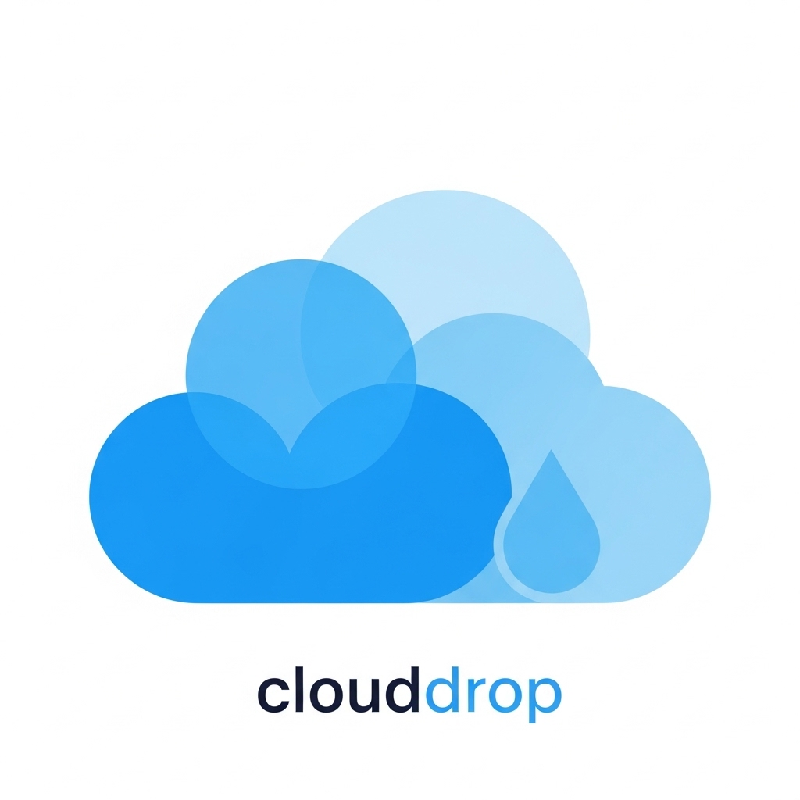

<div align="center">
	
	<h1>CloudDrop</h1>
</div>

> A simple CLI tool for sharing files P2P on your local network or over the public internet.

---

## Overview

CloudDrop allows you to share files in two ways:

### 1. Cloud-Based (Public Internet)

Skip the middleman (Discord, Gmail, Slack, etc.) with this free CLI tool that doesn't store your data. CloudDrop runs locally on YOUR machine and connects to a cloud storage provider for encryption and security.

### 2. P2P (Local Network)

Share files directly with friends or family—both clients just need the CloudDrop CLI installed. Pure byte-to-byte P2P sharing with full security and privacy.

---

## Description

CloudDrop enables you to share files or directories either P2P or over the public internet using Kafka and Google Storage. It ensures high security via access codes.

---

## Setup and Installation

_To be added_

---

## Usage

### Peer-to-Peer (Local Network)

**Client A (Sender):**
```bash
clouddrop drop /path/to/file
```

**Client B (Receiver):**
```bash
clouddrop pick
```

### Over Public Internet

**Client A (Sender):**
```bash
clouddrop send /path/to/file
```

**Client B (Receiver):**
```bash
clouddrop receive <code>
```

---

## Commands

| Command | Description |
|---------|-------------|
| `drop` | Upload files to P2P network. Must provide a valid file path to a file or directory. |
| `pick` | Receive files from P2P network. No arguments required. |
| `send` | Upload files over public internet. Must provide a valid file path. |
| `receive` | Receive files over public internet. Must provide a valid code received from the sender. |

---

## Example Use Cases

- Share files or directories between computers on your local network (P2P)
- Share files over the public internet
- Share files on your machine, effectively copying them to the receiver's path

---

## Contributing

Contributions are welcome! To get started:

1. Fork the repository
2. Create a feature branch
3. Make your changes
4. Submit a pull request

### Development Requirements

For development, you will need:
- An active `credentials.json` file in the project root
- An available bucket name in Google Cloud Storage

### Environment Variables

The following environment variables are required for development:

| Variable | Description |
|----------|-------------|
| `BUCKET_NAME` | Google Cloud Storage bucket name |
| `CREDENTIALS_PATH` | Path to your Google Cloud credentials.json file |
| `AUTHORITY` | URL of the authority server |
| `BOOTSTRAP_SERVER` | Kafka bootstrap server address |
| `KAFKA_API_KEY` | Kafka API key |
| `KAFKA_API_SECRET` | Kafka API secret |
